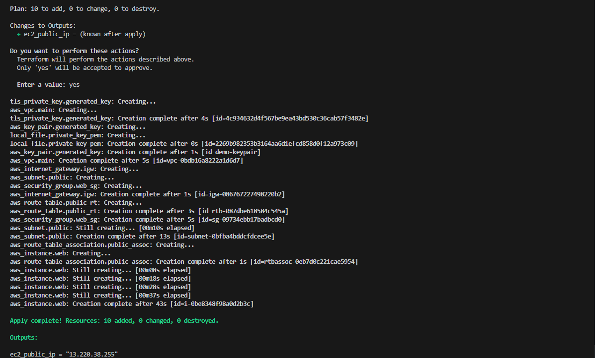

# 🚀 EC2 Web Server with Terraform

This project provisions an AWS EC2 instance, installs a web server via a `user_data.sh` script, and deploys a basic site — all using Terraform.

---

## 📦 What This Project Does

- Creates a **new VPC** with a public subnet
- Generates a new **SSH key pair** locally
- Provisions a **security group** with HTTP and SSH access
- Launches an **EC2 instance** with the above settings
- Runs a **user data script** to install and start a web server
- Outputs the **instance public IP** after creation

---

## 🔧 Files Overview

| File                | Purpose                                                        |
| ------------------- | -------------------------------------------------------------- |
| `main.tf`           | Core infrastructure — VPC, subnets, EC2 instance, key creation |
| `variables.tf`      | Input variables for the project                                |
| `terraform.tfvars`  | Actual values passed to variables                              |
| `security_group.tf` | Security group to allow inbound traffic                        |
| `user_data.sh`      | Bash script that installs & runs the web server                |
| `outputs.tf`        | Outputs the instance IP or DNS                                 |

---

## 🚀 How to Use

### 1. Clone the Repo

```bash
git clone https://github.com/43kae/terraform_ec2.git
cd terraform_ec2/terraform
```

### 2. Initialize Terraform

```bash
terraform init
```

### 3. Plan Infrastructure

```bash
terraform plan
```

### 4. Deploy

```bash
terraform apply
```

✅ On success, you’ll get a public IP like:

```
Outputs:
web_server_ip = "13.220.38.255"
```

Access it in your browser: `http://13.220.38.255`

---

## 🛡️ Security Group Rules

- Port **22** (SSH) - from `your_ip`
- Port **80** (HTTP) - from anywhere

---

## 🔐 Key Pair

A new key pair is generated at apply time and saved as `key_pair.pem` in the current directory. Use it to SSH into the instance:

```bash
chmod 400 key_pair.pem
ssh -i key_pair.pem ubuntu@<instance_ip>
```

---

## 📸 Screenshots

These screenshots are included in the `/screenshots` directory:





---

## 🩹 Teardown

```bash
terraform destroy
```

---

## 👤 Author

Built by [@](https://github.com/43kae) as part of the **Cloud Portfolio Projects** series.

